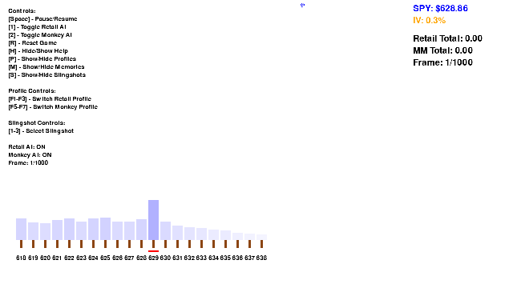

# Monkeys and Coconuts: Gamma Reflexivity Jungle


A game to showcase the theory of reflexivity using an adversarial neural network engine.

⚠️ This simulation models reflexive dynamics in options markets — how trader actions shape price movement and dealer response, and vice versa.

This is a gamified visualization of market maker and retail trader dynamics in the options market, featuring gamma profiles, slingshot mechanics, and AI-driven agents.

## Features

- **Real-time Market Simulation**: 
  - Visualizes SPY price, strikes, and gamma profiles
  - Models reflexive market dynamics and dealer hedging
  - Real-time gamma profile visualization
- **AI Agents**: 
  - Retail Agent with psychological profiles and adaptive targeting
  - Market Maker (Monkey) Agent with defensive strategies
- **Slingshot System**: 
  - Multiple slingshot types with unique properties
  - DTE-based projectile lifetime
  - Option type (calls/puts) mechanics
- **Dynamic Visualization**:
  - Gamma wells showing market maker sensitivity
  - Real-time juice collection metrics
  - Strike-specific tooltips
- **Agent Memory System**:
  - Historical performance tracking
  - Adaptive behavior based on past experiences
  - Memory curation and retrieval
- **Save System**:
  - Auto-save functionality with `--save` flag
  - Saves game state, agent memories, and statistics
  - Timestamped save files for easy tracking
  - CSV export for data analysis

## Project Structure

```
monkeysandcoconuts/
├── core/
│   ├── __init__.py
│   ├── agents/                # Open AI's Agents module
│   ├── data/
│   │   ├── __init__.py
│   │   ├── data_loader.py      # CSV data loading utilities
│   │   ├── portfolio.json      # Slingshot configurations
│   │   └── settings.json       # Data path configurations
│   ├── profiles/
│   │   ├── __init__.py
│   │   ├── profile_loader.py   # Agent profile management
│   │   ├── monkey_profile.json # MM agent behavior profile
│   │   └── retail_profile.json # Retail agent behavior profile
│   ├── engine.py              # Core game mechanics
│   ├── market_data_loader.py  # Historical data loading
│   ├── memory_logger.py       # Agent memory system
│   ├── monkey_agent.py        # Market maker agent logic
│   ├── retail_agent.py        # Retail trader agent logic
│   ├── save_manager.py        # Game state saving system
│   ├── setup.py              # Package configuration
│   └── ui.py                 # Pygame visualization
├── logs/                     # Agent memory storage
├── output/                   # Saved game states
└── run_game.py              # Main entry point
```

## Installation

1. Clone the repository:
```bash
git clone [repository-url]
cd monkeysandcoconuts
```

2. Install dependencies:
```bash
pip install -e .
```

## Usage

Run the game:
```bash
# Run without saving
python run_game.py

# Run with auto-save enabled
python run_game.py --save
```

When auto-save is enabled, the game:
- Creates timestamped save directories in `output/`
- Auto-saves every 100 frames
- Saves final state when exiting
- Stores game state, memories, and statistics

Save directory structure:
```
output/
├── YYYYMMDD_HHMMSS/
│   ├── game_state.json      # Main game state
│   ├── retail_memories.json # Retail agent memories
│   ├── monkey_memories.json # MM agent memories
│   └── statistics.csv       # Strike-specific stats
```

## Controls

- **[Space]**: Pause/Resume simulation
- **[1]**: Toggle Retail AI
- **[2]**: Toggle Market Maker AI
- **[R]**: Reset simulation
- **[H]**: Show/Hide help
- **[P]**: Show/Hide agent profiles
- **[M]**: Show/Hide agent memories
- **[S]**: Show/Hide slingshot info

### Profile Controls
- **[F1-F3]**: Switch Retail Agent profile
- **[F5-F7]**: Switch Market Maker profile

### Slingshot Controls
- **[1-3]**: Select different slingshots

## Game Elements

### Gamma Wells
- Blue background areas showing market maker gamma exposure
- Height indicates gamma strength at each strike
- Influences coconut hit probability and juice distribution

### Slingshots
1. **Standard**
   - Balanced power and accuracy
   - Medium DTE
   - Call options focused

2. **Power**
   - High power, lower accuracy
   - Short DTE
   - Aggressive call targeting

3. **Sniper**
   - High accuracy, lower power
   - Long DTE
   - Put options focused

### Agent Profiles
- **Retail Agent**:
  - Optimism bias
  - FOMO threshold
  - Pattern recognition
  - Risk tolerance

- **Market Maker**:
  - Risk aversion
  - Reflexivity awareness
  - Defense radius
  - Learning rate

### Memory System
- Agents record successful and failed attempts
- Memory importance based on outcome impact
- Automatic curation of outdated memories
- Influences future decision-making

## Data Integration
- Loads historical SPY price data
- Integrates option chain data for strikes
- Calculates real gamma profiles when available
- Fallback to synthetic data when needed

## Save System
The save system captures:
- Current game state (spot price, strikes, etc.)
- Agent memories and learning
- Strike-specific statistics
- Gamma profiles and market conditions

Data is saved in both JSON and CSV formats for:
- Game state restoration
- Data analysis
- Strategy evaluation
- Performance tracking




## Contributing
Feel free to submit issues, fork the repository, and create pull requests for any improvements.

## License
This project is licensed under the MIT License - see the LICENSE file for details.

## Acknowledgments
- Thanks to all contributors and testers
- Inspired by real market dynamics and gamma hedging mechanics 
